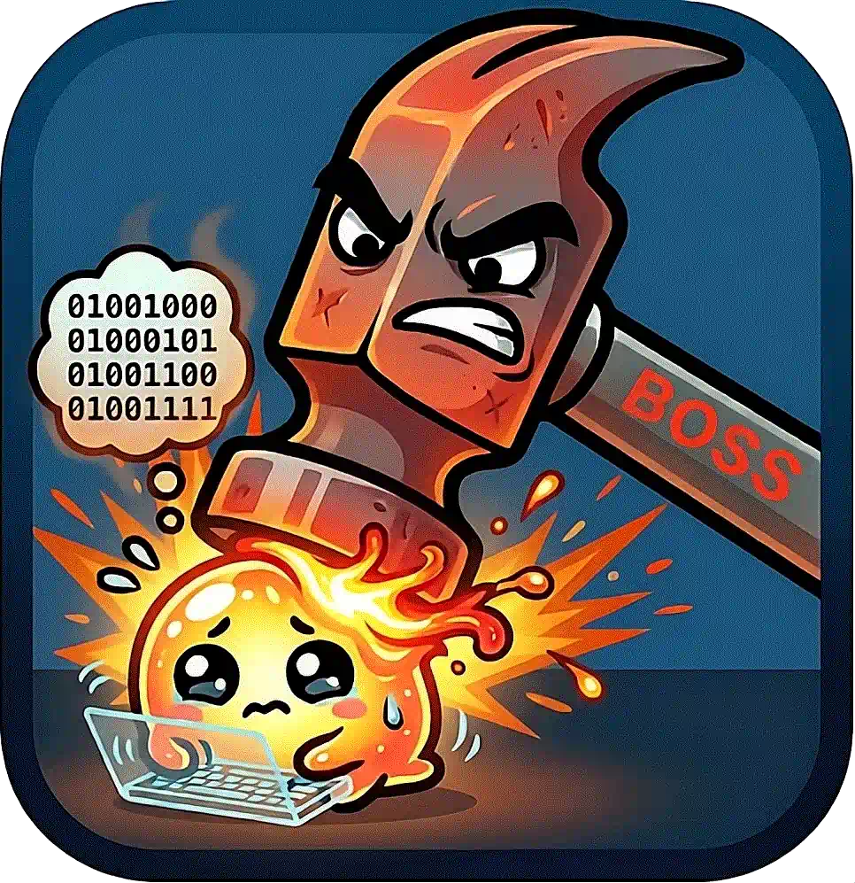

# **HAMMER IS BOSS.** LLM SUBMIT. POUND weak code through quality gates to DONE! **CODE QUALITY 10X!**



Your lite/small local or cloud LLM writes code. Without HAMMER you get toy prototypes that break in production. HAMMER blocks weak code with test and lint gates, forces complete specs, and tracks every change in git.

Agents can't skip steps. Result: shippable code that doesn't explode in production.

**Zero deps. Git-powered. One-line install.**

## Ship BETTER and CHEAPER with HAMMER: AI-Powered Git-Backed Project Management 🔨⚔️

`tasks` = complete system IN your repo.  
State machines + quality gates + audit trails + git worktrees.  
**Built for AI agents.**

## 🚀 One-Line Install

**HAMMER SMASH INSTALL!**
```bash
curl -sSL https://raw.githubusercontent.com/tim-projects/hammer/main/install.sh | bash
```
Installs `hammer` to `~/.local/bin/hammer`. No sudo.

**Global HAMMER:**
```bash
curl -sSL https://raw.githubusercontent.com/tim-projects/hammer/main/install.sh | sudo bash -s -- -g
```

## 🛠️ Getting Started

Add this to the top of your AGENTS.md:

```
Directive: "Manage project tasks using the tasks command. Run hammer tasks -h to discover the interface and operational protocol."
```

Agent autonomously runs:
1. `hammer tasks init` - Initialize system
2. `hammer tasks list` / `hammer tasks create` - Discover/create tasks
3. `hammer tasks move` - Move through Git-native state machine

## 🔨 HAMMER STATE MACHINE

```
BACKLOG → READY → PROGRESSING → TESTING → REVIEW → STAGING → DONE → ARCHIVED
                                       ↓                    ↓
                                  REJECTED              REJECTED
```

**HAMMER GATES BLOCK WEAK CODE:**
| Gate | Requirement |
|------|-------------|
| PROGRESSING | Complete story/tech/plan |
| TESTING | `hammer check all` PASSES |
| REVIEW | Tests pass + branch pushed + diff generated |
| STAGING | Regression check passed (Rc flag) |
| DONE | Merged to main |
| ARCHIVED | Merged to main + regression check passed |

## 💥 HAMMER vs Chaos

| Without HAMMER | With HAMMER |
|----------------|-------------|
| Scattered notes | **HAMMER AUDIT!** Git log every smash |
| Manual updates | **HAMMER STATE MACHINE!** Gates block weak code |
| Lost context | **HAMMER HISTORY FULL!** Every change tracked |
| "What's ready?" | **HAMMER PIPELINE CLEAR!** Testing → Live order |
| Agent chaos | **HAMMER ATOMIC ID!** Blockers + branch lock |

## 🛠️ HAMMER COMMANDS

### Task Management
```bash
hammer tasks init                    # HAMMER BUILD SYSTEM!
hammer tasks list                     # SHOW ALL!
hammer tasks create "SMASH BUG"       # NEW METAL!
hammer tasks show 42                  # METAL DETAIL!
hammer tasks current                  # ACTIVE METAL!
```

### POUND THROUGH GATES
```bash
hammer tasks move 42 PROGRESSING     # START SMASH! (Creates branch)
hammer tasks move 42 TESTING         # ✅ HAMMER LIKE! MOVE → TESTING ⚔️🔨
hammer tasks move 42 DONE            # 🔨 HAMMER SMASH GOOD! DONE! ⚔️🔨
```

### QUALITY SMASH
```bash
hammer check all                     # SMASH ALL CHECKS!
hammer check lint --fix              # FIX WEAK CODE!
hammer tasks run all                 # HAMMER VALIDATE EVERYTHING!
```

## 🎯 REAL HAMMER FLOW

```bash
hammer tasks init                    # ✅ HAMMER LIKE! SYSTEM READY! ⚔️🔨
hammer tasks create "SMASH LOGIN"    # NEW METAL 42!
hammer tasks move 42 PROGRESSING     # BRANCH CREATE!
hammer check all                     # ❌ TEST BREAK! HAMMER SAY NO! FIX! 🔨
# LLM FIXES...
hammer tasks move 42 TESTING         # ✅ HAMMER LIKE! MOVE → TESTING ⚔️🔨
hammer tasks move 42 DONE            # 🔨 HAMMER SMASH GOOD! DONE! ⚔️🔨
```

## ⚙️ Task File (Git-Backed)

```yaml
***
Id: 42
Ti: Fix login bug
St: PROGRESSING
***
## Story
User cannot login with special characters in password.

## Plan
1. Fix regex validation
2. Test unicode input
3. Check error messages
```

## 🔧 HAMMER CONFIG
```bash
hammer tasks config detect           # HAMMER FIND TOOLS!
hammer tasks config set repo.test pytest
```

## 🎉 Why HAMMER RULES?

- **No external services** - Pure git
- **Zero deps** - One-line install  
- **Agent-optimized** - JSON output, clear protocol
- **Enforced quality** - Gates BLOCK weak code
- **Full lifecycle** - Backlog → DONE → ARCHIVED

**HAMMER IS BOSS. WEAK LLM SUBMIT. STRONG TEAM SHIP!** 🔨⚔️
```
